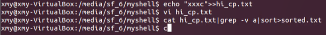

A simple shell program for practice.

**RUN**: 
    `$chmod +x shell`
    `$./shell`

Grammar analysis using flex and bison, `shell.y` and `shell.l`

functionalities:

- built-in command: cd, exit
- other command by calling `execvp()`
- pipe, input/output redirection

